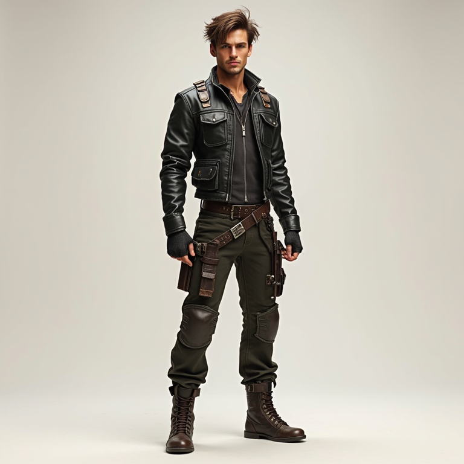
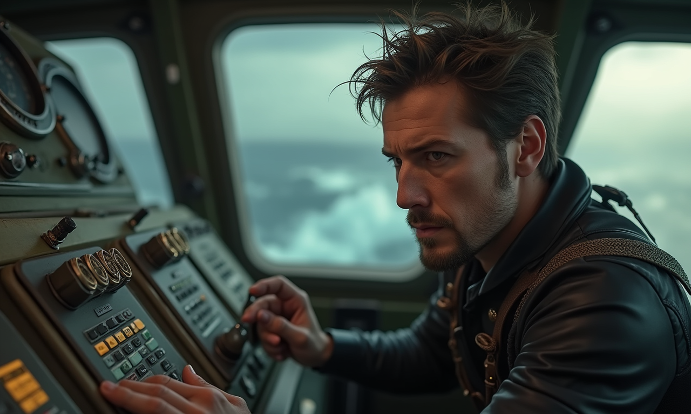
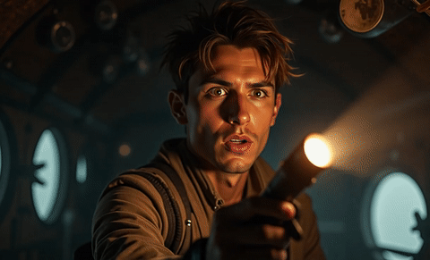

# Micro-Drama Agent

Micro-Drama Agent is a multi-stage generation pipeline for turning a user story or a script synopsis into character-consistent micro-drama content. It decomposes the creation process into structured stages, including story planning, character setup, sub-script generation, scene and shot breakdown, keyframe generation, and image-to-video rendering.

This repository focuses on the current working codebase and demo assets for the project. Large local model weights are intentionally excluded from version control.

## Highlights

- Story-to-video style pipeline: from `user_story` or script synopsis to shot-level generation.
- Structured generation stages: `script -> scene -> shot -> video`.
- Character-consistent generation with CharacterBank support.
- Multiple image generation backends, including `InstantCharacter` and `CharaConsist`.
- Multiple image-to-video backends, including `CogVideoX`, `I2Vgen`, `SVD`, and `HunyuanVideo_I2V`.


## Pipeline Overview

The project is designed as a staged agent workflow:

1. Story input  
   User provides either a natural-language story via `--user_story` or a prepared synopsis JSON via `--script_path`.
2. Script decomposition  
   The agent expands the story into structured sub-scripts, scenes, and shots.
3. Character preparation  
   Character references are organized into a CharacterBank for more stable visual identity.
4. Shot-level keyframe generation  
   Each shot is converted into prompt-conditioned keyframes with a character-consistent image model.
5. Image-to-video rendering  
   Generated keyframes are animated into short video clips.
6. Optional consistency checking  
   Bounding-box based similarity checks can be used to retry weak character generations.

## Demo

### Visual Assets

Character reference example:

<p align="center">
  
</p>

Generated examples:

<p align="center">
  
  
  
</p>

### Video Demos
<p align="center">
  
  
  
</p>

## Repository Structure

```text
Micro-Drama Agent/
├── microdrama_agent/       # Main pipeline code
├── imgutils-main/          # Image utility library used by the project
├── show/                   # Demo assets for README and project showcase
├── requirements.txt        # Python dependencies
└── .gitignore              # Ignore rules for local weights, caches, and outputs
```

## Installation

Create a Python environment and install the dependencies:

```bash
pip install -r requirements.txt
```

If you want to use the bundled image utility source directly, keep `imgutils-main/` in the repository as included here.

## Quick Start

The main entrypoint is [`microdrama_agent/run.py`](microdrama_agent/run.py).

Generate from a natural-language story:

```bash
python microdrama_agent/run.py   --user_story "A short emotional reunion story between two old friends."   --character_photo_path ./characters   --LLM deepseek-v3   --gen_model InstantCharacter   --Image2Video CogVideoX
```

Run from an existing synopsis JSON:

```bash
python microdrama_agent/run.py   --script_path ./path/to/story.json   --character_photo_path ./characters   --gen_model CharaConsist   --Image2Video HunyuanVideo_I2V
```

Image-only mode for faster testing:

```bash
python microdrama_agent/run.py   --script_path ./path/to/story.json   --character_photo_path ./characters   --gen_model InstantCharacter   --images_only
```

## Key Arguments

- `--user_story`: natural-language story input.
- `--script_path`: path to a prepared synopsis JSON.
- `--character_photo_path`: reference character image folder.
- `--gen_model`: keyframe generation backend.
- `--Image2Video`: video generation backend.
- `--images_only`: generate keyframes only, skip video rendering.
- `--resume`: reuse existing intermediate stage outputs.
- `--start_from`: resume from `script`, `scene`, `shot`, `video`, or `final`.
- `--only`: run a specific shot, such as `"Scene 2,Shot 1"`.

## Notes

- This repository does not include large local model weights.
- Local runtime paths are configured to prefer models placed under `microdrama_agent/models` when available.
- Some third-party model subdirectories may originate from external projects; only the current integrated code is kept here as the working version.

## Acknowledgement

This project integrates multiple open-source components and model backends to build a practical micro-drama generation workflow.
